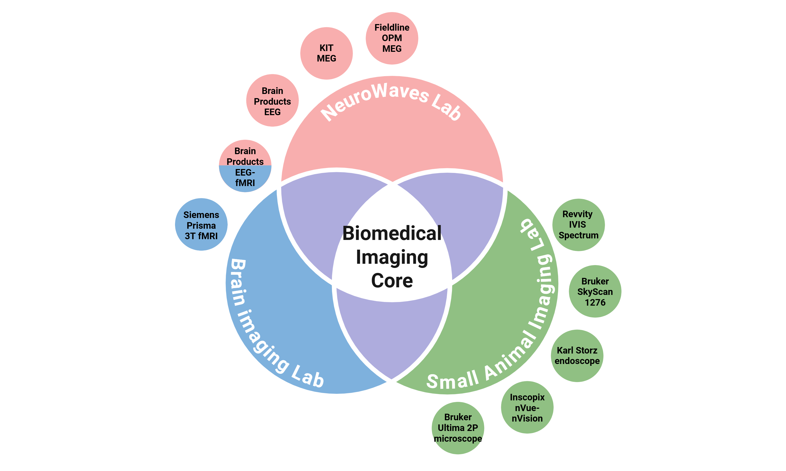
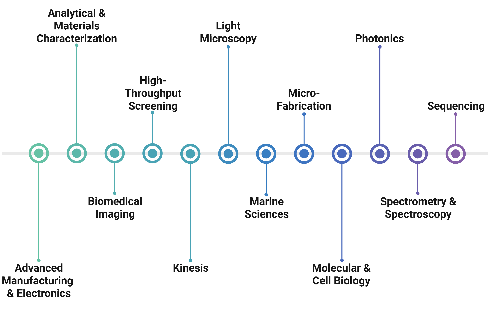
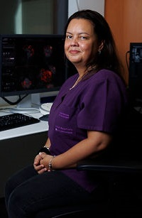
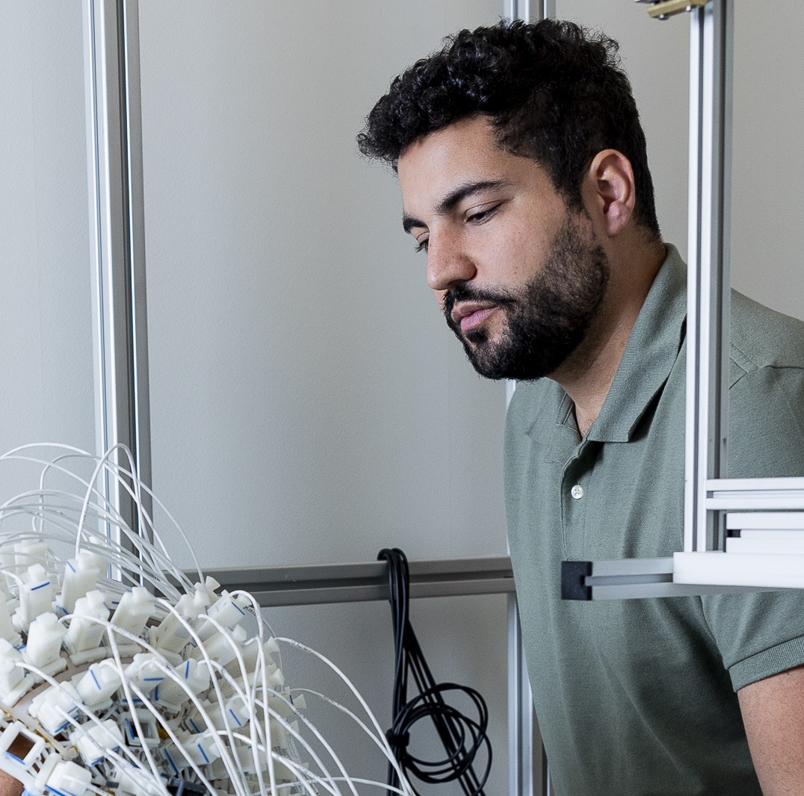
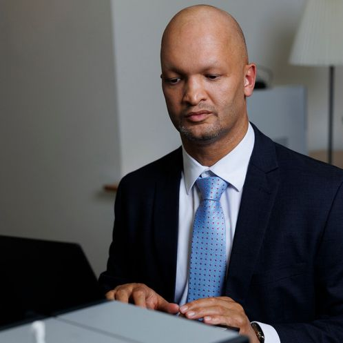
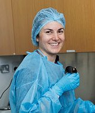

BioMedical Imaging Core
=======================

The **Biomedical Imaging Core**  comprising the **Brain Imaging Lab**, the **NeuroWaves Lab** and the **Small Animal Imaging Lab**
is one of twelve specialized cores within the **Core Technology Platforms** (CTP) at NYU Abu Dhabi.

*Biomedical Imaging Core*

CTP encompasses a **wide range of advanced instrumentation**, supported by a team of **dedicated scientists** and **technical**
**experts** who manage equipment maintenance, provide comprehensive user training, and facilitate research operations across
the university.
For more information about available technologies and support services, please visit the CTP website:
https://nyuad.nyu.edu/en/research/facilities-and-support/core-technology-platforms.html

*NYUAD Core Technology Platforms*

Core team
---------

Haidee Paterson
===============

**MRI Instrumentation Specialist**

Haidee is an MRI radiographer with 25 years of experience, primarily in clinical MRI practice.
Over the past 7 years, she has specialized as a research instrumentation specialist,
leveraging her extensive experience to advance MRI research.
Her focus is on supporting research projects in three distinct areas:
MRI data acquisition, MRI integrated with EEG, and MEG data acquisition.

`haidee.paterson@nyu.edu <mailto:haidee.paterson@nyu.edu>`_

.. raw:: html

   

Hadi Zaatiti
============

**MEG Research Scientist I**

Hadi is an MEG Research Scientist, specialized in MEG-EEG data processing,
with a background in designing embedded systems, representation learning and electrical engineering.
His main role is to support MEG-EEG projects by ensuring correct operation of the systems and processing of acquired data.

`hadi.zaatiti@nyu.edu <mailto:hadi.zaatiti@nyu.edu>`_

.. raw:: html

   

Osama Abdullah
==============

**MRI Physicist II**

Osama is a research scientist and physicist who manages the daily operations of the BioMedical Imaging Core
at New York University Abu Dhabi, overseeing a research-dedicated 3-Tesla Siemens MRI scanner,
the MEG lab, and the Small Animal Imaging lab on campus.
In his role, he supports research activities and advances technical capabilities by
supervising researchers and technical staff and providing scientific assistance.

`osama.abdullah@nyu.edu <mailto:osama.abdullah@nyu.edu>`_

.. raw:: html

   

Maylis Boitet
=============

**Small Animal Imaging Research Scientist I**

Since August 2023, Dr. Boitet has served as the inaugural **Research Instrumentation Scientist** for the Small Animal Imaging
Lab at New York University Abu Dhabi (NYUAD). She earned her Ph.D. from Institut Pasteur Korea, where she characterized
a reporter mouse model for neuroinflammation using in vivo optical imaging. Her research focuses on **neuroscience** and optical
imaging, with particular emphasis on the application of **advanced imaging modalities** to study brain function in preclinical
models. Dr. Boitet also holds a **Doctor of Veterinary Medicine** (DVM) degree from VetAgro Sup in Lyon. At NYUAD, she actively
collaborates with researchers to integrate **non-invasive imaging strategies** into preclinical research studies.

`maylis.boitet@nyu.edu <mailto:maylis.boitet@nyu.edu>`_

.. raw:: html

   

Brain Imaging Lab
-----------------

- `Brain Imaging Lab Documentation <https://brainimaging-lab-documentation.readthedocs.io/>`_

Neurowaves Lab
--------------

- `Neurowaves Lab Documentation <https://neurowaves.readthedocs.io/>`_

Small Imaging Lab
-----------------

- `Small Animal Imaging Lab Documentation <https://smallanimalimaging.readthedocs.io/>`_

.. toctree::
   :maxdepth: 2
   :caption: BioMedical Imaging Core
   :hidden:

   1-brainimaging
   2-neurowaves
   3-smallanimalimaging
